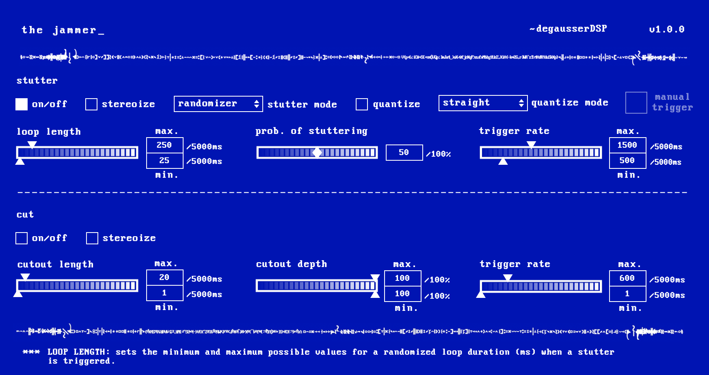

# the woodchipper

the jammer by ~degausserDSP is a digital glitch audio plugin. the "stutter" module emulates a broken CD player, randomly causing the incoming audio to get stuck and loop. the "cutout" module creates randomized volume drops. 

the jammer is an open-source plugin under a GPL v3.0 license, meaning you can use and modify the source code as much as you want (though it must remain open source if you are distributing it). additionally, it is free to download and use! [though, feel free to buy us a coffee :)](https://www.buymeacoffee.com/degausserDSP)

visit [tannerjones.tv](https://www.tannerjones.tv) for more info!
